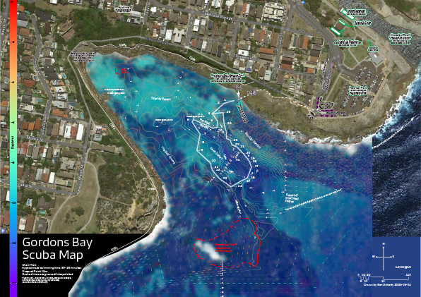
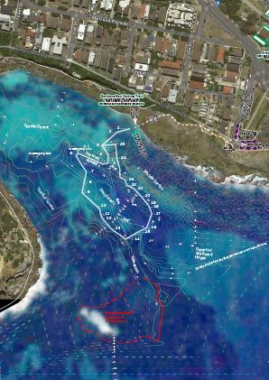

# 📌 Making a dive map of Gordon's bay, a WIP 🗺

As part of my [divemaster course](https://www.prodive.com.au/Sydney+-+Alexandria/Divemaster+/Divemaster+Orientation+/1124), I need to make a map of a dive site. I'm doing Gordon's bay. It's a marine reserve, and it's very pretty. It also has a [scuba club](https://www.gordonsbayscubadiving.com/), and the club maintains an underwater trail around the bay that divers can follow without too much worry of getting lost.

Oddly, there's no up to date map of Gordon's that I've found. There are a couple of maps ([a](https://www.gordonsbayscubadiving.com/trail.html)—drawn in 1990, [b](https://www.viz.net.au/maps-of-shore-dive-sites/gordons-bay)) that show the trail, the Google Maps satellite map, and another satellite map from [Michael McFadyen's website](https://www.michaelmcfadyenscuba.info/viewpage.php?page_id=282).

<figure>

<figcaption>Several maps of Gordon's bay, overlaid on each other.</figcaption>

</figure>

If you want, you can download the map I made, as it stands now, from here:

| Full map, 1:2000 @ A3              | Zoomed map 1:2000 @ A4 or 1:1414 @ A3 |
| ---------------------------------- | ------------------------------------- |
|  |              |
| [full](docs/Gordons_map_wip.pdf)   | [zoomed](docs/zoomed.pdf)             |

The idea is that the full map is one side of an A3 page, and the zoomed one is the back, but you can use the zoomed on an A4 if you like. You can also print the full map on A2 if you're extra keen.

If you want to read about how I made the map, [you can look here](process.md).

The plan is to keep updating it over time as I get out there and get data from ore bits of the bay, and improve the code that generates the contours.
