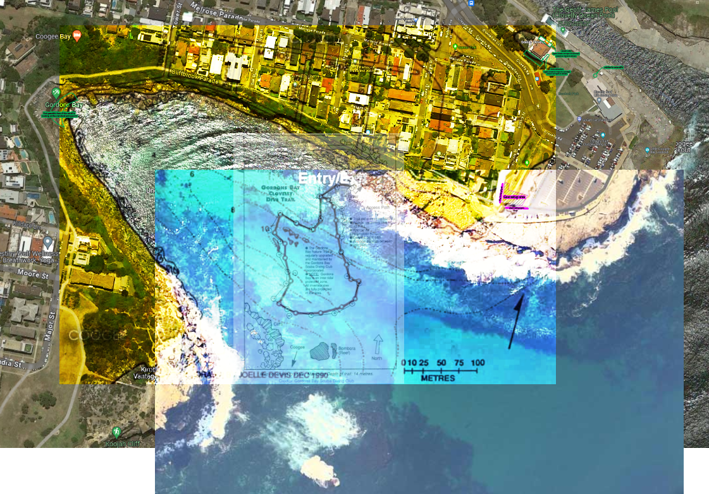
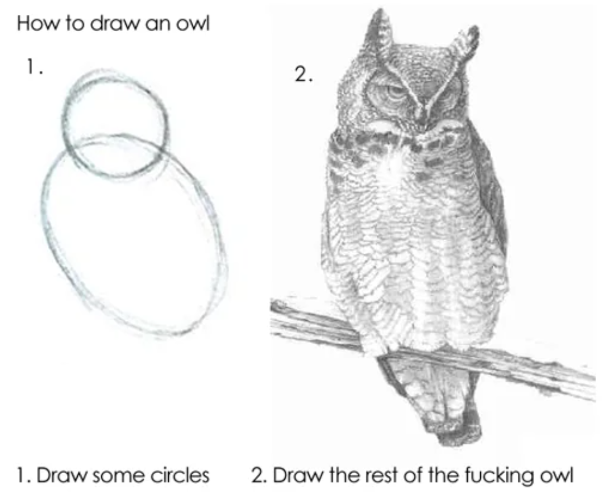
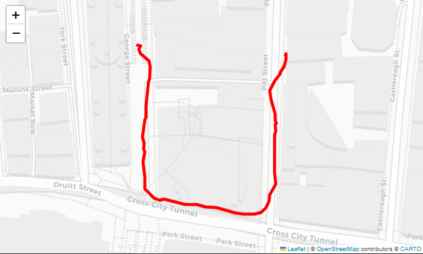

# 📌 Making a dive map of Gordon's bay, a WIP 🗺

As part of my divemaster course, I need to make a map of a dive site. I'm doing Gordon's bay. It's a marine reserve, and it's very pretty. It also has a [scuba club](https://www.gordonsbayscubadiving.com/), and the club maintains an underwater trail around the bay that divers can follow without too much worry of getting lost.

Oddly, there's no good map of Gordon's that I've found. There are a couple of maps ([a](https://www.gordonsbayscubadiving.com/trail.html), [b](https://www.viz.net.au/maps-of-shore-dive-sites/gordons-bay)) that show the trail, the Google Maps satellite map, and another satellite map from [Michael McFadyen's website](https://www.michaelmcfadyenscuba.info/viewpage.php?page_id=282).

<figure>

<figcaption>Several maps of Gordon's bay, overlaid on each other.</figcaption>

</figure>

## What can I do better?

The maps above are very sparse, so making one a bit better is going to be quite easy, but can I make one a lot better? Can I approach [this](https://www.viz.net.au/maps-of-shore-dive-sites/bare-island) quality?

### GPS

Following [Marco Bordieri](https://www.viz.net.au/do-it-yourself/a-surfaceable-gps)'s lead, I've bought myself a [waterproof box](https://www.anacondastores.com/fishing/fishing-storage/tackle-boxes/plano-guide-series-1450-waterproof-case/90038539) to put my phone in. I'm going to make a _very_ shoddy surface bouy out of a milk crate, a body board, and a dive flag [photos coming once I actually make it].

The plan now is to drag that around the trail, and the other underwater features, to get a map of where I've been. Then merge the resulting `.gpx` file with the data from my watch (somehow) to get depths and important times.

### String survey

I've marked a builders' string at 2m intervals, so I'll lay down the line, and take depths, manually in my wet notes. This will give some sense of whether or not the contours from the map are right or not.

### Loads of photos

Taking a tonne of pictures and videos will give me a sense of what to draw.

### Draw the rest of the fucking owl

I've started testing what the GPS tracker gives me. The `.gpx` file in this repo is me walking around the block at work.

This isn't perfect, e.g. I didn't cross the road on the right hand side, but I'm hoping that's down to map inaccuracy, not GPS drift. Hopefully, given that there's a good view of the sky from the ocean, and the data will all match up with itself.
