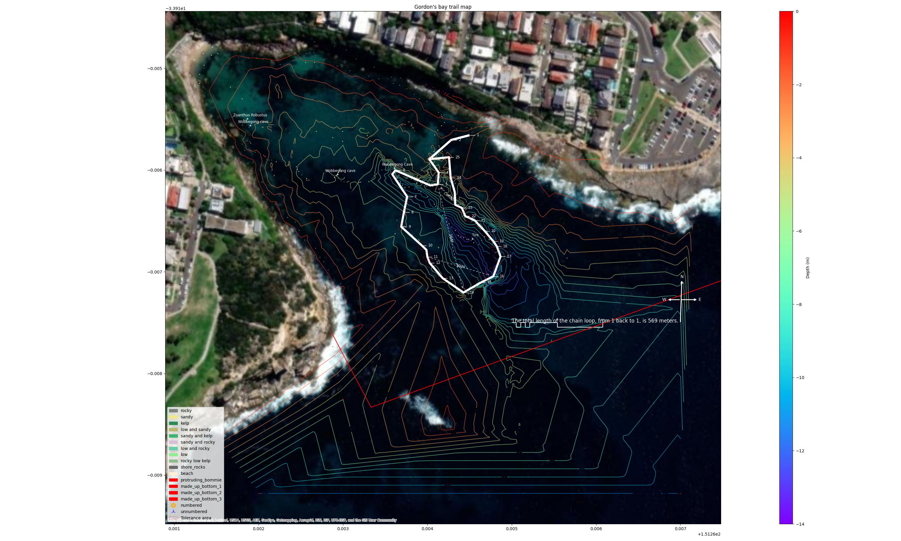

# 📌 Making a dive map of Gordon's bay, a WIP 🗺

As part of my divemaster course, I need to make a map of a dive site. I'm doing Gordon's bay. It's a marine reserve, and it's very pretty. It also has a [scuba club](https://www.gordonsbayscubadiving.com/), and the club maintains an underwater trail around the bay that divers can follow without too much worry of getting lost.

Oddly, there's no good map of Gordon's that I've found. There are a couple of maps ([a](https://www.gordonsbayscubadiving.com/trail.html), [b](https://www.viz.net.au/maps-of-shore-dive-sites/gordons-bay)) that show the trail, the Google Maps satellite map, and another satellite map from [Michael McFadyen's website](https://www.michaelmcfadyenscuba.info/viewpage.php?page_id=282).

<figure>

<figcaption>Several maps of Gordon's bay, overlaid on each other.</figcaption>

</figure>

## What can I do better?

The maps above are very sparse, so making one a bit better is going to be quite easy, but can I make one a lot better? Can I approach [this](https://www.viz.net.au/maps-of-shore-dive-sites/bare-island) quality?

### GPS

Following [Marco Bordieri](https://www.viz.net.au/do-it-yourself/a-surfaceable-gps)'s lead, I've bought myself a [waterproof box](https://www.anacondastores.com/fishing/fishing-storage/tackle-boxes/plano-guide-series-1450-waterproof-case/90038539) to put my phone in. I'm going to make a _very_ shoddy surface bouy out of a milk crate, a body board, and a dive flag [photos coming once I actually make it].

The plan now is to drag that around the trail, and the other underwater features, to get a map of where I've been. Then merge the resulting `.gpx` file with the data from my watch (somehow) to get depths and important times.

### String survey

I've marked a builders' string at 2m intervals, so I'll lay down the line, and take depths, manually in my wet notes. This will give some sense of whether or not the contours from the map are right or not.

### Loads of photos

Taking a tonne of pictures and videos will give me a sense of what to draw.

### Draw the rest of the fucking owl

### GPS testing

I've started testing what the GPS tracker gives me. The `.gpx` file in this repo is me walking around the block at work.

This isn't perfect, e.g. I didn't cross the road on the right hand side, but I'm hoping that's down to map inaccuracy, not GPS drift. Hopefully, given that there's a good view of the sky from the ocean, and the data will all match up with itself.

The stack for this is:

1. A [GPS Logger](https://play.google.com/store/apps/details?id=eu.basicairdata.graziano.gpslogger&hl=en&gl=US) app. This one works well, exports easily to google drive, and doesn't chew through my battery.
2. A [Sunnto D5](https://www.suunto.com/en-au/Products/dive-computers-and-instruments/suunto-d5/suunto-d5-white/) computer. Works fine, exports to a `.fit` file from the phone.
3. A [GoPro 12](https://gopro.com/en/au/shop/cameras/hero12-black/CHDHX-121-master.html). These photos are useful because it means I don't need to get the wet notes out, I can just take photos and then see where the photos are on the GPS track. The 12 doesn't actually have GPS, but that doesn't really matter because it doesn't work underwater anyway. You could use any camera at all, we're just interested in the EXIF data.
4. A bit of python in a GitHub Codespace. I can't install packages on my work computer, but I can do everything I need to in a remote machine, for free.

Something that's interesting is that I didn't need to install anything on my laptop, or run any code locally\*, I was able to export all the data using my phone and Google Drive.

- That's not quite true, I did need to [extract the EXIF] data, but that only used libraries that are in the standard work image.

### First GPS dive

Tali and I went for a swim around the chain on 9/3/24 and dragged the GPS float (photos of that coming). I left the GPS running the whole morning and it was actually completely fine, no overheating or battery issues.

I swam the float around, and touched my computer hand to the base of each numbered marker, and intermediary buoy, and while my hand was there, [Tali took a photo](https://gopro.com/v/WlwGaV9nvZ5RO). The timestamps from the EXIF data tell me when I was at a marker. (Also, I know my tank trim is horrible. I'm going to fix that.)

We did two dives, one around the chain, and one following the sand line of the boulder garden.

You can see how the data is processed in `mapper.py`, it gives an output like this:

The red is the first (chain) dive, and the green is the second (boulder garden) dive. The blue sections are where the photos were taken.

I overlaid the tracks onto a folium map, and then overlaid _that_ into the existing maps I've been collecting. The interesting thing is that the GPS trail is not only a different size, it's a substantially different shape.

The first map was drawn in 1990 by Joelle Devis, and it's really good. Odd that it's so hard to find on the internet, and odder that it hasn't been updated. I found it because the inset map is republished on [Michael McFadyen's website](https://www.michaelmcfadyenscuba.info/viewpage.php?page_id=282). My guess is that this map is drawn by dead reckoning, using distances and headings. It's also possible that sections of the chain have moved over the last 34 years.

There is going to be some degree of inaccuracy in the GPS track, and I need to calculate that once I get the depth data. I can assume that the float line is the edge of a cone, probably less than 80° at the point. So there will be more error possible at depth. I should be able to draw those circles.

#### Some more progress (10/3/24)

This shows the position of the photos and the depths along the trail.

There's a [zoomable map that shows the path from the dives here](https://notionparallax.github.io/dive-map/gordons_map).

I don't have data for a few of the markers. I'm not sure if the camera just didn't go off, or the marker is buried in the sand, or what. I also need to add in the intermediate buoys because I don't think the runs are straight between the numbered markers.

This shows the numbered markers that I have waypoints for, but the missing points don't seem to be at the obvious corners. More will be revealed when I do another dive, and when I've found a way to pinpoint the intermediate buoys.

There's quite a lot going on in that graph now!

- The orange Os are the numbered markers They are labelled with their marker number, and the file name of the photo
- The  is an un-numbered marker. (I've got a plan to map these out properly, but it's going to be a fair bit of work.) They are labelled with the file name of the photo
- The rainbow line is the path we swam around the chain. It's coloured by depth, and that depth is shown in the colour bar on the right
- The dashed circles around the numbered markers show tolerance. This is where the point _could_ be if the wind or current etc. was pushing the float around. They assume that the marker is the tip of a downward facing cone, and that cone has a tip angle of 70°. The circle is where the cone intersects the surface.
- The coloured blocks in the background show the ground condition. Each photo has a ground condition, and it's using a [voronoi diagram](https://en.wikipedia.org/wiki/Voronoi_diagram) to assume that condition until another point's influence takes over. This is going to need a _lot_ more swimming around to get it to be useful, but the infrastructure is there for that data when it comes.

  | Photo                  | Metadata                                                                                                                                                                                                                                                                                                                                              |
  | ---------------------- | ----------------------------------------------------------------------------------------------------------------------------------------------------------------------------------------------------------------------------------------------------------------------------------------------------------------------------------------------------- |
  |  | This is the data entry in `photo_meta.py`: <pre>{  "dt": datetime.datetime(2024, 3, 8, 10, 6, 29),  "filename": "GOPR0193.JPG",  "marker_type": "intermediate",  "marker_number": "",  "bottom_condition": "kelp",  }</pre> I don't know if keeping going with this method is the best idea, or if I should just use a spreadsheet. |
